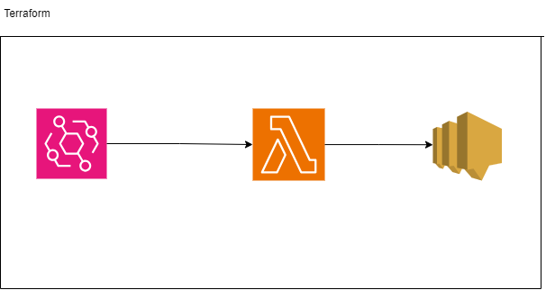

This Terraform Code will create an lambda function: That will check the url status by a simple get request, then will send an alert to an SNS topic subscribed email if the status code of get request is not 200 or if there is any exception retured. 

Then I have created an eventbridge rule for continuous monitoring of the url that will will invoke the lambda function in every hour of the day(we can set the frequency)

Lambda function is used because of its serverless nature and for minimum cost will only get billed for the time it runs. 
SNS topic subscription has 2000 mail alert free for 1 month.




USE Visual Studio code to see the diagram correctly
Flow of the Terraform code.
  +----------------+       +----------------+       +-----------------+
  |                |       |                |       |                 |
  | AWS CloudWatch |       |   AWS Lambda   |       |    AWS SNS      |
  |    Event       +------->   Function     +------->    Topic        |
  |    (Schedule)  |       |                |       |                 |
  |                |       |                |       |                 |
  +----------------+       +----------------+       +-----------------+
           |                       |                        ^
           |                       |                        |
           |                       |                        |
           v                       v                        |
  +----------------+       +----------------+                 |
  |                |       |                |                 |
  |  EventBridge   +-------> EventBridge    |                 |
  |    Rule        |       |    Target      +-----------------+
  |                |       |                |
  +----------------+       +----------------+

# Terraform Module: AWS Lambda URL Checker

This Terraform module sets up an AWS Lambda function that periodically checks a URL using AWS EventBridge scheduling, sends alerts via SNS, and allows manual testing

## Components Created

- **IAM Role (`aws_iam_role.lambda_role`)**:
  - Role Name: `lambda-role-url-checker`
  - Policies Attached:
    - AWS Managed Policy: `AWSLambdaBasicExecutionRole` for basic Lambda execution.

- **Lambda Function (`aws_lambda_function.url_checker_lambda`)**:
  - Function Name: Defined by `var.lambda_function_name`
  - Runtime: Defined by `var.lambda_runtime`
  - Handler: Defined by `var.lambda_handler`
  - Timeout: 60 seconds
  - Environment Variables:
    - `SNS_TOPIC_ARN`: ARN of the SNS topic for alerts (`aws_sns_topic.alerts`).

- **EventBridge Rule (`aws_cloudwatch_event_rule.schedule_rule`)**:
  - Rule Name: `InvokeUrlCheckerLambdaRule`
  - Description: Schedules Lambda function invocation every hour (`rate(1 hour)`).
  - Event Pattern:
    ```json
    {
      "source": ["aws.events"],
      "detail-type": ["Scheduled Event"],
      "resources": ["*"]
    }
    ```

- **EventBridge Target (`aws_cloudwatch_event_target.invoke_lambda_target`)**:
  - Targets Lambda function (`aws_lambda_function.url_checker_lambda`) with URL as an input parameter (`key1`).
  - Lifecycle Configuration:
    - `ignore_changes = all`: Ignores changes for manual testing purposes.

- **SNS Topic (`aws_sns_topic.alerts`)**:
  - Topic Name: `url-checker-alerts`
  - Display Name: `URL Checker Alerts`

- **SNS Topic Subscription (`aws_sns_topic_subscription.email_subscription`)**:
  - Subscription: Email subscription (`var.sns_email_subscription`) to receive alerts from `aws_sns_topic.alerts`.

## Manual Steps

- **Subscription**: You need to manually subscribe an email address to the SNS topic `url-checker-alerts` for receiving alerts.

## Notes

- **Environment Variables**: The URL to check is passed as an environment variable (`key1`) in the EventBridge rule configuration.
- **Lifecycle Management**: `ignore_changes = all` is set on the EventBridge target to avoid unintended modifications during manual testing.

## Usage
module "lambda_url_checker" {

  source = "./path/to/module"

  // Define variables here
  var.lambda_function_name = "url-checker-lambda"
  var.lambda_handler       = "lambda_function.lambda_handler"
  var.lambda_runtime       = "python3.8"
  var.sns_email_subscription = "your.email@example.com"
}
